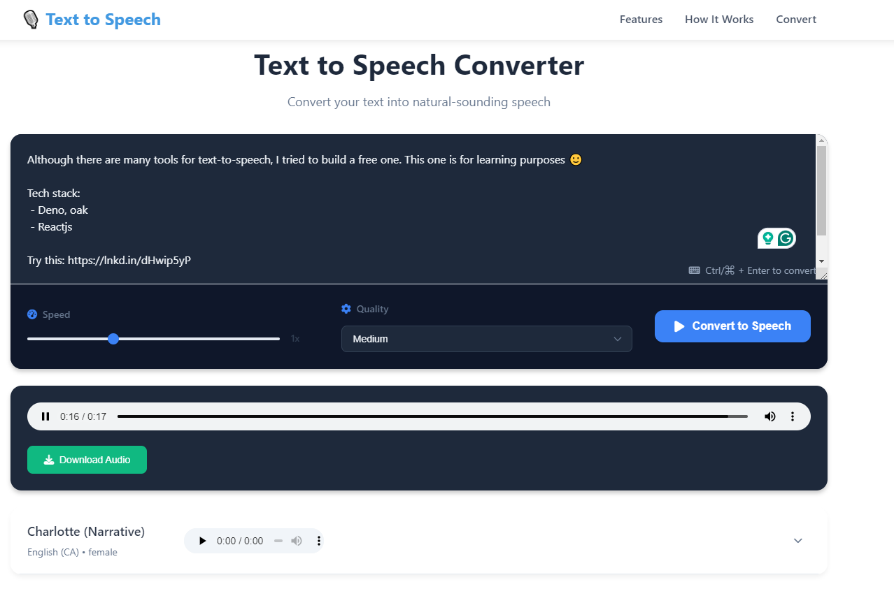

# Text to Speech Converter (Frontend)

A modern, user-friendly text-to-speech converter built with React, TypeScript, and Vite. Convert text to natural-sounding speech with multiple voice options and customization features.



## 🚀 Features

- ✨ Modern, responsive UI
- 🎯 Multiple voice options
- ⚡ Real-time voice preview
- 🎛️ Adjustable speech speed and quality
- 💾 Download converted audio
- ⌨️ Keyboard shortcuts support
- 🌓 Dark mode support
- 🌐 Cross-browser compatibility

## 🛠️ Technologies Used

- React 18
- TypeScript
- Vite
- CSS Modules
- Font Awesome
- React Helmet (SEO)

## 📦 Installation

1. Clone the repository:
```bash
git clone https://github.com/bek-shoyatbek/text-to-speech-ui.git
cd text-to-speech-ui
```

2. Install dependencies:
```bash
npm install
```

4. Start the development server:
```bash
npm run dev
```

## 🔧 Configuration

### API Configuration

Update the API endpoint in `src/api/index.ts`:
```typescript
export const API_URL =  your_api_url;
```

## 📖 Usage

1. Enter or paste your text in the text area
2. Select a voice from the available options
3. Adjust speed and quality settings if needed
4. Click "Convert to Speech" or use Ctrl/Cmd + Enter
5. Play the converted audio or download it

### Keyboard Shortcuts

- `Ctrl/Cmd + Enter`: Convert text to speech
- `Space`: Play/pause audio (when audio player is focused)


## 🤝 Contributing

1. Fork the repository
2. Create a feature branch
3. Commit changes
4. Push to the branch
5. Open a Pull Request

## 👥 Authors

- Bek Shoyatbek - [GitHub](https://github.com/bek-shoyatbek)
- LinkedIn - [Bek Shoyatbek](https://www.linkedin.com/in/bek-shoyatbek/)
- Twitter - [Bek Shoyatbek](https://twitter.com/bek-shoyatbekov)
